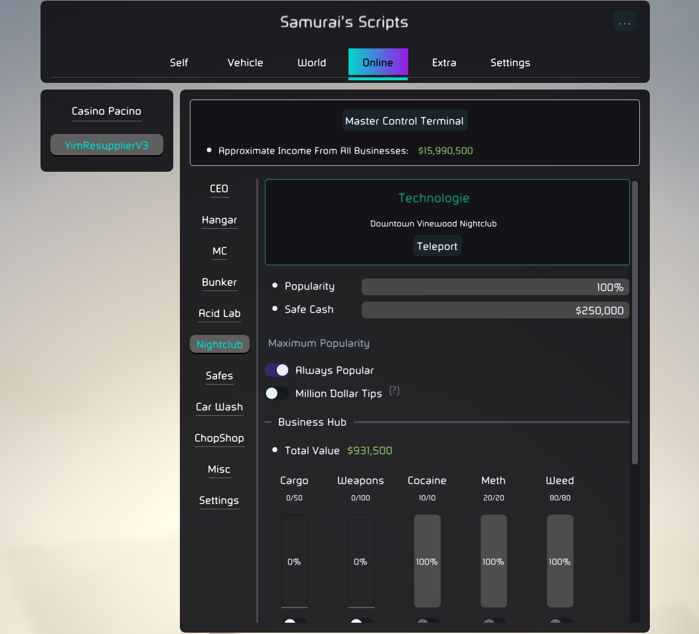

  
  
  
  
   
  
  

# About

A modular GTA V Lua framework focused on enhancing the player's experience through fun features, online business options, and unpopular opinions.

## Getting Started

### Setup

- Download the latest zip archive from the [releases section](https://github.com/YimMenu-Lua/Samurais-Scripts/releases/latest).
- Extract the archive to YimMenu's `scripts` folder:

       %AppData%\YimMenu\scripts

- Once in-game, press **[F5]** to toggle the script's UI.

### Commands Console

- Use **[F4]** to toggle the console window.
- Type `!ls` or `!dump` to dump all available commands.
- All default commands are prefixed with an exclamation mark `<!>`.

## Contributing

Contributions are what make the open source community a great place to learn, inspire, and create. Any contributions you make are **greatly appreciated**.

If you have a suggestion that would make this project better, please fork the repo and create a pull request. You can also simply open a [feature request](https://github.com/YimMenu-Lua/Samurais-Scripts/issues/new?template=request.yml).

Don't forget to give the project a star!

1. Fork the repo
2. Create your feature branch.
3. Commit your changes.
4. Open a Pull Request.

Refer to the [Contribution Guidelines](./CONTRIBUTING.md) for more details on the project's structure and conventions.

## Documentation

This project was rewritten from scratch using [SmallBase](https://github.com/xesdoog/SmallBase). For API documentation, please refer to the [docs](https://github.com/xesdoog/SmallBase/tree/main/docs).

>[!Note]
> Some parts of the API were refactored or extended but nothing has drastically changed.
> All changes introduced in this project are documented in the source.

## Contact

  

## Acknowledgments

|                                                   |                                                                                |
| :---:                                             | :---:                                                                          |
| [Harmless](https://github.com/harmless05)         | Shift-Drift                                                                    |
| [NiiV3AU](https://github.com/NiiV3AU)             | German translations                                                            |
| [gir489returns](https://github.com/gir489returns) | [Casino Pacino](https://github.com/YimMenu-Lua/Casino-Pacino)                  |
| [tupoy-ya](https://github.com/tupoy-ya)           | Several contributions and shared knowledge                                     |
| [szalikdev](https://github.com/szalikdev)         | Revived the project and joined the cause                                       |
| [ShinyWasabi](https://github.com/shinywasabi)     | Foundational community tooling frequently used as reference                    |
| [UnknownCheats.me](https://unknowncheats.me)      | A treasure trove of information                                                |
